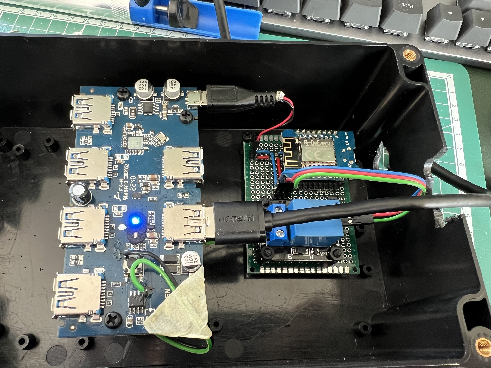

# usb-switch-switcher

We combine a small Wemos D1 Mini and a dumb UGREEN usb switch to control the selected usb target device via mqtt.

## hardware

We use the UGREEN 2 to 4 USB 3.0 switch: [https://de.ugreen.com/products/ugreen-usb-switch](https://de.ugreen.com/products/ugreen-usb-switch-2pc-usb-3-0-switcher-2-in-4-out-usb-kvm-switch-mit-2-usb-3-0-a-auf-a-kabeln-fur-tastatur-maus-drucker-scanner-usb-sticks-usw) and a Wemos D1 mini. Any other esp8266-based microcontroller with wifi should work too.

The relay used is a KY-019 relay like this one: [https://www.amazon.de/ARCELI-ST%C3%9CCKE-KY-019-Relaismodul-arduino](https://www.amazon.de/ARCELI-ST%C3%9CCKE-KY-019-Relaismodul-arduino).

The hardware is connected like this:

```
ESP:
ESP8266 Pin D1 -> Signal line of relay
ESP8266 ground pin -> ground rail
ESP8266 5V in -> 5V rail

RELAY:
VCC -> 5V rail
ground pin -> ground rail
Middle pin -> ground pin of octocoupler? (Green cable in picture cabling.jpg)
Normally open (NO) -> pin of smd switch (Black cable in picture cabling.jpg)

Broken out micro usb:
Ground pin -> ground rail
5V pin -> 5V rail
```

As the micro usb port can be used to be power the esp8266 when the switch itself is powered by the active usb target itself, it needs to be broken out. Just use an old micro usb cable, clip it, strip the ends and use the
- red wire for 4.7 volts
- black wire for ground
This way you dont need additional power.

## software

### wemos

Clone the code and add the file `Settings.h` to the folder `include`. Then you have to fill in your correct parameters:

```cpp
#define WIFI_SSID ""                    // SSID of your wifi network
#define WIFI_PSK ""                     // Preshared key of your wifi network
#define MQTT_BROKER ""                  // IP address of your mqtt broker / homebridge
#define MQTT_USER ""                    // Username for authenticating to mqtt broker
#define MQTT_PASSWORD ""                // Password for authenticating to mqtt broker
#define OTA_HOSTNAME ""                 // Hostname to reach HTTPUpdateServer
#define OTA_USERNAME ""                 // Username for authentication on OTA update server
#define OTA_PASSWORD ""                 // Password for authentication on OTA update server
```

After that you can build the code and flash it to your Wemos.

### homebridge

In Homebridge we need the plugin `homebridge-mqttthing`. The usb switch can then be attached with the following config:

```json
        {
            "type": "switch",
            "name": "USB target 1",
            "username": "",
            "password": "",
            "logMqtt": true,
            "topics": {
                "getOn": "office/usb/target/1",
                "setOn": "office/usb/target/1"
            },
            "integerValue": true,
            "accessory": "mqttthing"
        },
        {
            "type": "switch",
            "name": "USB target 2",
            "username": "",
            "password": "",
            "logMqtt": true,
            "topics": {
                "getOn": "office/usb/target/2",
                "setOn": "office/usb/target/2"
            },
            "integerValue": true,
            "accessory": "mqttthing"
        }
```

Setting `logMqtt` to `true` is optional but logs the changed mqtt values to homebridge. Please adjust `username` and `password` to the correct values for your mqtt broker.

## pictures




## TODO

- Add Fritzing